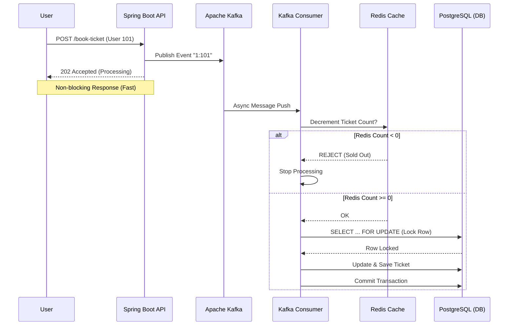

#  TicketBlitz - High-Concurrency Distributed Booking System

A production-grade distributed system simulation demonstrating how to handle massive traffic spikes using **Event-Driven Architecture**, **Caching**, and **Locking**.

---

## 📖 The Problem

In standard ticket booking systems, a **race condition** occurs when thousands of users try to buy the last ticket simultaneously.

**Scenario:** 1 ticket left. 500 users click **Buy**.

**Result (Without Logic):** The database allows all 500 users to read **“1 ticket available”** before anyone updates it.

**Consequence:** You sell **501 tickets**. The event is oversold by **500%**.

✅ **TicketBlitz solves this** using a multi-layered defense strategy:

**Redis (Throttling) + Kafka (Queuing) + Postgres (Pessimistic Locking)**

---


## 🏗 System Architecture

The system follows a high-performance **Event-Driven Architecture** designed to handle **10k+ TPS**.




## 🛠 Tech Stack

| Component | Technology | Usage |
|---|---|---|
| Backend | Java 25, Spring Boot 3.4 | Core Application Logic (Virtual Threads enabled). |
| Database | PostgreSQL 16 | Persistent storage and Pessimistic Locking source. |
| Cache | Redis (Alpine) | In-memory inventory counter (the “Gatekeeper”). |
| Broker | Apache Kafka (KRaft) | Asynchronous message queue for decoupling writes. |
| DevOps | Docker Compose | Orchestrates the multi-container environment. |

## 🧪 Engineering Journey

This project was built in phases to demonstrate the evolution from a **“broken”** app to a **“distributed”** one.

| Phase | Goal | Status | Outcome |
|---|---|---|---|
| Phase 1 | Setup | ✅ Done | Dockerized Postgres, Redis, Kafka environment. |
| Phase 2 | The Crash | ✅ Done | Reproduced “Lost Update” bug. Sent 500 requests for 100 seats → Result: **982 Phantom Tickets sold**. |
| Phase 3 | Data Safety | ✅ Done | Implemented Pessimistic Locking. Result: **0 Phantom Tickets**, but slow performance. |
| Phase 4 | Scaling | ✅ Done | Implemented Redis Caching (Cache-Aside pattern) to protect the DB from read-heavy traffic. |
| Phase 5 | Async | ✅ Done | Decoupled the API using Kafka. The server now accepts requests instantly and processes them in the background. |


---

## 🚀 Getting Started

Follow these steps to run the complete system locally.

### ✅ Prerequisites

- **Docker Desktop** (must be running)
- **Java 21+** (project uses Java 25)

---

### Step 1: Clone the Repository

```bash
git clone https://github.com/YOUR_USERNAME/ticket-blitz.git
cd ticket-blitz
```

---

### Step 2: Start Infrastructure

We use Docker to spin up Postgres, Redis, and Kafka automatically.

```bash
docker compose up -d
```

**Tip:** Wait ~30 seconds for Kafka to fully initialize.

---

### Step 3: Run the Application

Use the included Maven Wrapper to start the Spring Boot server.

```bash
./mvnw clean package -DskipTests
./mvnw spring-boot:run
```

Application will start on:

- `http://localhost:8080`

---

## 🎮 Testing & Attack Simulation

### 1) Simple Manual Test

Simulate a single user buying a ticket.

```bash
curl -X POST "http://localhost:8080/api/bookings?eventId=1&userId=999"
```

**Expected Output:**

`⏳ Request Received! We are processing it in the background.`

---

### 2) Check the "Audit" Monitor

This endpoint compares the **Actual DB Rows** vs the **Available Count**. It is your **"Lie Detector"** for concurrency bugs.

```bash
# Open in Browser or Curl
http://localhost:8080/api/bookings/audit?eventId=1
```

---

### 3) The "Massive Attack" (Load Test)

To prove the system works, run the included load-test script (`attack.sh`) to simulate **N concurrent users**.

- **$1** = number of requests to send
- If **$1** is omitted, it defaults to **500**
- If **$1** is not a positive integer (> 0), the script exits with an error message

#### ✅ Run (defaults to 500 requests)

```bash
chmod +x attack.sh
./attack.sh
```

#### ✅ Run with custom load (e.g., 2000 requests)

```bash
./attack.sh 2000
```

✅ **Verification:**

After the script finishes, check the Audit Endpoint.

- Total Seats: **100**
- Actual Sold: **100**
- Phantom Tickets: **0**
- System Status: ✅ **Clean**

---

## 🔌 API Reference

| Method | Endpoint | Description |
|---|---|---|
| POST | `/api/bookings?eventId=1&userId=1` | Queues a booking request via Kafka. Returns **202** immediately. |
| GET | `/api/bookings/status?eventId=1` | Returns the current ticket count (from DB). |
| GET | `/api/bookings/audit?eventId=1` | Admin Tool: Checks for data integrity violations (overselling). |

---

## 🤝 Contributing

This project is a portfolio demonstration of **Distributed Systems Engineering**.

- Fork the repository
- Create a feature branch: `git checkout -b feature/my-change`
- Commit your changes: `git commit -m "Add my change"`
- Push to your fork: `git push origin feature/my-change`
- Open a Pull Request
>>>>>>> 3c0db7a (Update README.md and attack.sh files)
